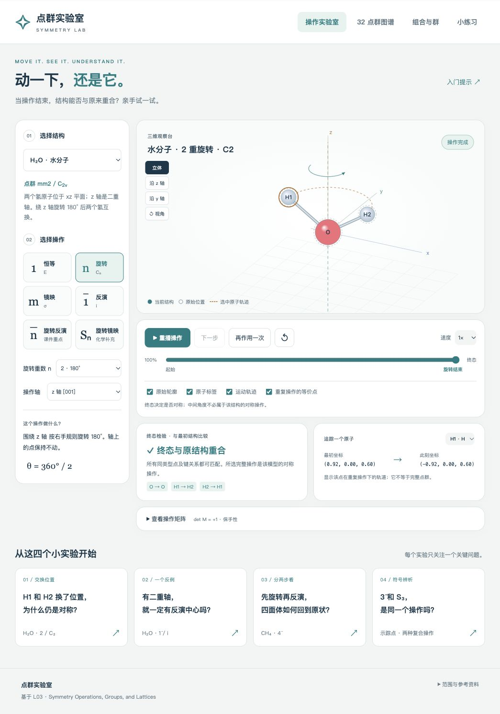

# 点群实验室 · 看见对称性

**[在线体验点群实验室](https://ideaschangeworld.github.io/symmetry-lab/)** · 直接在浏览器打开，无需下载或安装。



面向刚开始学习点群的学生，用可以拖动视角、分步播放和追踪坐标的三维模型，理解“操作完成后，结构为什么还是它”。内容衔接 MATSCI 402 的 L03、L04、L05：从点对称、群操作与 32 点群，继续到立体投影、子群、物性约束、14 Bravais 晶格、堆积与周期晶体结构。项目重新绘制交互模型；原课件没有上传到公开仓库。

## 打开项目

离线使用时，在 GitHub 仓库页面点击 **Code → Download ZIP**，下载后先解压，再双击解压后文件夹根目录的单文件 `symmetry-lab.html`；全部样式、内容与脚本都在一个文件中，便于保存或分享。

使用源码目录时，保持项目文件在同一目录，**直接双击 `index.html`** 也可以打开。项目不依赖网络、外部字体、CDN 或软件包，无须安装依赖。浏览器需启用 JavaScript；参考资料链接只有在点击时才需要网络。

也可以在此项目目录打开终端，运行：

```sh
python3 -m http.server 8042 --bind 127.0.0.1
```

然后打开 [http://127.0.0.1:8042](http://127.0.0.1:8042)。服务仅绑定本机，终端中按 `Ctrl+C` 停止。此方式需要已有 Python 3；直接双击打开不需要它。

## 六个模块

| 模块 | 可以做什么 | 学习目标 |
| --- | --- | --- |
| 操作实验室 | 选择结构、轴或镜面，播放 E、Cₙ、σ、i、n̄、Sₙ；查看矩阵、坐标与终态匹配 | 区分对称元素与操作，理解同类原子互换 |
| 32 点群图谱 | 每个点群都有独立三维模型，可选择并播放全部群内操作、查看对称元素；用三维晶格尝试 1–12 重旋转 | 对照记号、群阶与三维对称性，理解晶体学旋转限制 |
| 组合与群 | 并排比较 AB、BA；查看水分子 C₂ᵥ 的乘法表与四条群公理 | 理解右边操作先做，交换律不是群的必要条件 |
| 进阶对称 | 全 32 点群球面与立体投影联动、5 组子群、二阶张量与极性向量、二色反对称、9 种空间操作 | 理解方向表示、对称降低与物性约束 |
| 晶体结构 | 14 Bravais、17 周期原型、原胞与传统胞、周期配位、AB/ABC、FCC 孔隙占位、半径比 | 从晶格与基元构造结构，连接组成、局部配位与完整点群 |
| 小练习 | 20 道题即时反馈，配 16 条术语释义；新题可以跳转相应模块 | 用预测与解释检查概念理解 |

“操作实验室”保留 8 个理想模型，与图谱中每个点群的独立模型分别使用：

| 模型 | 完整点群 / 用途 |
| --- | --- |
| 水 H₂O | mm2 / C₂ᵥ；观察二重旋转交换两个 H |
| 氨 NH₃ | 3m / C₃ᵥ；观察三重旋转 |
| 四氟化氙 XeF₄ | 4/mmm / D₄h；比较四重旋转、水平镜面和反演 |
| 甲烷 CH₄ | 4̄3m / T_d；观察四面体的旋转反演 |
| 六氟化硫 SF₆ | m3̄m / Oₕ；观察八面体的多条旋转轴 |
| 正六边形 | 6/mmm / D₆h；观察六重旋转和重复轨道 |
| 四种点的四面体 | 1 / C₁；A、B、C、D 是不同类型，交换它们不能算对称 |
| 单个示踪点 | 观察坐标映射、复合与操作顺序；不用于确定分子或晶体的完整点群 |

分子坐标是任意单位的理想几何示意，不是实验结构或量子化学计算结果。

## 32 点群的三维模型

在“32 点群图谱”中点击任意条目，即可直接查看该点群的独立三维模型。模型由完整群操作作用于一般位置点，生成多个不同颜色的轨道；其完整点群与所选条目一致。同颜色的点可以互换，不同颜色不能互换。**这些彩色点是用于表达对称性的几何模型，不是真实分子、原子种类或实验晶体结构**，不替代操作实验室中的 8 个示例。

操作列表包含该群的全部操作，包括恒等 E；选择任意操作并播放，观察彩色点如何在终态回到同颜色点的位置。可暂停、调整进度并重播，拖动视角与缩放从不同方向观察，同时对照所选操作的矩阵。镜映、反演与非正旋转的中间动画仍是教学插值；判断对称性看完整操作的终态。

模型同时展示旋转轴、镜面与反演中心，并列出群阶、操作数量与对称元素统计。**操作数与轴、面的数量分别统计**：同一条旋转轴可以对应多个不同角度的操作，不能把轴数当作群阶。图谱根据已知的 32 个点群生成模型，便于比较它们的全部操作与几何元素；它不自动识别任意输入结构的点群。

## 15 分钟学习路线

点击实验室底部的四个引导实验卡片即可载入对应设置。

1. **0–3 分钟：水的 C₂。** 播放绕 z 轴的 180° 旋转，追踪 H1。H1 到了 H2 的初始位置，H2 到了 H1 的初始位置，但终态仍重合。编号用于追踪，同类型原子可以交换。
2. **3–6 分钟：水的反演反例。** 对相同结构执行 i。观察三个坐标同时变号后，H 找不到相同类型的原始位置。二重轴不会自动带来反演中心。
3. **6–10 分钟：甲烷的 4̄。** 用“下一步”停在 90° 旋转后的中间态，再继续中心反演。检查终态而不是中间态；旋转与反演两个分步骤不必分别是此结构的对称操作。
4. **10–13 分钟：示踪点的 3̄ 与 S₃。** 记录 3̄ 终态坐标，然后保持轴和 n = 3，切换 Sₙ 比较。两个操作的第二步不同，因此通常到达不同位置。

最后 **13–15 分钟**，到“组合与群”比较 C₄(z) 与镜映的 AB、BA，再回答几道小练习。使用列向量时，`AB p = A(B p)`，所以 AB 表示先 B 后 A。

## 操作与观察

- **选择与参数：** 改变模型、操作、重数 n、轴或镜面后，播放进度和重复次数重新开始。模型自带一个推荐操作，可以继续探索成立或不成立的操作。
- **相机：** 拖动画布改变观察视角，滚轮缩放；“立体”“沿 z 轴”“沿 y 轴”提供固定视角，“↺ 视角”恢复默认相机。相机变化只改变观察方式，不改变结构坐标或对称性。
- **键盘：** 画布获得焦点后，用方向键调整视角，`+` / `−` 缩放；主画布中空格播放或暂停。
- **播放：** 可暂停、拖动进度条或使用“下一步”。复合操作播放到第一步结束会停下，再次播放继续第二步。可选 0.5×、1×、2× 速度。
- **原子追踪：** 点击原子或使用“追踪一个原子”下拉框，查看最初坐标、此刻坐标和轨迹；可开关标签、原始轮廓与轨迹。
- **重复作用：** 操作完成后点击“再作用一次”，观察累计操作。“重复操作的等价点”显示选中点在这一操作的幂作用下产生的轨道，它不是完整点群的所有等价位置。结构可能先重合，而被追踪的同类原子还没有回到自己的编号位置。
- **重置：** “↺”恢复最初结构与播放进度；它与重置相机是两个独立按钮。

播放位置、模型选择、视角与练习答案保存在当前页面的内存中。刷新或关闭页面后重新开始；项目不会上传学习记录，也不使用持久化存储。

## 两套非正旋转记号

本项目以课件使用的晶体学 Hermann–Mauguin 记号为主，补充常见分子对称性记号。

| 记号 | 完整操作 | 特例 |
| --- | --- | --- |
| n̄（旋转反演） | 绕轴旋转 360°/n，再关于轴上的原点反演 | 1̄ = i；2̄ = 垂直于轴的镜面 |
| Sₙ（旋转镜映） | 绕轴旋转 360°/n，再关于垂直于轴、过原点的镜面反射 | S₁ = σ；S₂ = i |

例如沿 z 轴时，第二步分别是 `(x,y,z) → (−x,−y,−z)` 与 `(x,y,z) → (x,y,−z)`。因此 **同下标不代表同一单次操作**。3̄ 与 S₆ 生成同类点群；4̄ 与 S₄ 也生成同一点群，但在采用同向 90° 旋转的约定下，它们是互逆操作。

旋转反演用到一个反演点，不代表单独的 i 属于结构的对称群。例如 4̄ 点群没有反演中心，3̄ 点群则含 i。点群只要求至少一个共同固定点；Cₙ 固定整条轴，Cₛ 固定整个镜面，因此“点群”不意味着恰好只有一个点不动。

## 动画与终态的区别

终态检验使用完整操作的正交矩阵，匹配同类型原子位置，并检查模型中表示的键关系。中间动画用于解释坐标如何变化，不能作为对称性判断依据。

尤其是镜映与反演，动画采用连续插值，可能暂时压扁结构、缩短键长，甚至让点经过原点。这些中间帧不是分子的真实刚体运动，也不模拟原子的运动机制。矩阵的行列式与操作阶等信息描述完整操作。

## 三维晶格与晶体学限制

在“32 点群图谱”的“为什么这里没有 5？”中，选择 **1–12 重旋转**，比较绕 z 轴旋转 `360°/n` 后的格点。两个示例分别由方格层、三角网格层沿 z 方向重复生成，显示三层格点与三根独立基矢。选择“自动选择合适示例”，或手动切换晶格；用“播放旋转”“看终态”“回到起点”和进度条观察过程。拖动改变立体视角、滚轮缩放，点“俯视”比较格点位置；画布获得焦点后也可用方向键、加减键与空格控制。

画面分别给出**对所有三维周期晶格的限制**与**当前示例绕 z 轴是否成立**。允许某个重数，表示存在合适的晶格；不代表每一种晶格都拥有它。方格层的示例支持 1、2、4 重，三角网格层的示例支持 1、2、3、6 重。动画中的中间角度暂不判断；终态按无限晶格的整数坐标检验，不把有限显示窗口的边缘当作晶格边界。轴上仍不动的格点也不能代表整个晶格重合。

展开证明可看到一般结论：旋转若保持晶格，在原胞基底下的矩阵 `A = B⁻¹RB` 必为整数矩阵，故其迹是整数；相似变换保持迹，三维正旋转满足 `tr R = 1 + 2cos(360°/n)`。可取的整数迹为 −1、0、1、2、3，对应 n = 2、3、4、6、1。五重的迹约为 1.618；所有 n ≥ 7 的迹都严格处于 2 与 3 之间。**两个具体点阵提供直观例子，一般排除结论来自整数迹条件**，并不限于按钮展示的 1–12 重。有限分子与非周期准晶不受这个平移周期条件约束。

## L04：从方向、子群到物性

立体投影覆盖全部 32 点群：拖动球面，改变种子极角与方位角，在圆盘中追踪方向。上半球从南极投到赤道面，下半球从北极投影，用实点、空心点与赤道方块区分；同一投影位置可能对应不同半球。镜面迹线来自实际镜面大圆，灰色坐标线明确只是辅助线。一般／特殊方向的轨道数不同，单个方向轨道不用于判完整点群。

子群实例使用同一坐标系中的真实操作子集，显示母群、子群阶数和指数；不把轴向不一致的同类型群直接比较成“不是子群”。物性区对全部 32 群计算群平均：极性向量不变空间，以及普通对称二阶极性张量的形式和独立系数数目。椭球与数值均为教学示例。普通线性体压电对中心对称类与 432 禁止，对其余类仅在对称性上允许；极性不是铁电的充分条件。

二色模型比较 2、2′、1′，只展示指定内部标签翻转。它不是化学物种交换或完整磁群模型。9 个空间操作提供纯平移、2₁/3₁/3₂/4₁/6₃、m/a/n 的分步映射与重复轨迹，明确完整幂中的晶格平移和取商后的点群操作不同。不是 230 空间群生成器。

## L05：从晶格与基元到周期结构

14 个 Bravais 示例分别显示格点、双原子教学基元及其结构，可切换真正原胞与传统胞、1 胞与 2×2×2 区域。原胞含一个平移格点，原子数还取决于基元；R 采用六方传统设置时含 3 格点。HCP 的平行六面体胞含 2 原子，常见六棱柱画法相当于 3 个这样的胞，计入 6 原子。CsCl 使用 P 晶格加两原子基元，并不是 BCC 单原子晶格。

17 个结构原型：SC、BCC、FCC、HCP、金刚石、石墨、NaCl、CsCl、NiAs、闪锌矿、纤锌矿、CdI₂、CdCl₂、金红石、锐钛矿、萤石与反萤石。各原型给出空间群、点群、基矢、半开传统胞的完整原子坐标与原胞原子数；长度归一化，内部参数采用明示教学值，不是当前实验测量。结构形状与物种可读，能跳转对应点群模型。配位从无限周期结构查找，含显示窗外的邻居；原型约定的第一配位壳包含近邻畸变，例如 TiO₆ 的 4＋2。

ABAB／ABC 可逐层显示；FCC T/O 孔隙可以追踪 CN4／6，并用空、半、全占据观察计量。O 位点三分之一占据用三个胞的整数计数示范 AB₃，不冒充真实 CrCl₃ 多型坐标。孔隙多面体连线仅表达局部几何。CN4／6／8 硬球壳的临界比为 √(3/2)−1、√2−1、√3−1，滑块展示局部接触或重叠；这些临界值不能单独预测真实结构。

## 范围

本版本覆盖 L03–L05 的主要几何概念。新增平移、螺旋轴与滑移面操作入门，并提供 17 个核查过的周期结构原型；不枚举全部 230 空间群，不自动识别任意输入结构，不预测实际材料物性或磁序。课件里的历史、样本统计、论文案例与 CrCl₃ 多型／CrI₃ 磁性以延伸阅读衔接。

详见 [课程整合指南](course-guide.html)（网页）及 [内容对应表](COURSE_GUIDE.md)（文字）。页码采用 PDF 实际页序，与课件页脚印刷编号可能不同。

32 种是普通三维**平移周期晶体**的点群类型；其允许的旋转重数为 1、2、3、4、6。有限分子或几何模型可以有 C₅ 等对称性，不能把晶体学限制推广到所有有限物体。

操作实验室判断所选操作是否保持当前模型；32 点群图谱提供分类速查及每个已知点群的完整操作与独立三维模型。项目不自动识别任意输入结构的完整点群。表中“仅含保手性操作”描述群的性质，不能据此断言构成晶体的每个分子都具有手性。

## 文件与验证

| 文件 | 职责 |
| --- | --- |
| `index.html` | 六个模块的页面结构 |
| `styles.css` | 页面样式与响应式布局 |
| `app.js` | Canvas 三维投影、播放、交互和练习 |
| `math.js` | 矩阵与坐标变换、操作动画、位置与键匹配、8 个模型 |
| `learning-data.js` | 32 点群、测验、术语与参考资料 |
| `lattice-math.js` | 三维晶格基矢、晶格坐标、整数矩阵与旋转重数检验 |
| `lattice-view.js` | 晶体学限制演示的三维绘制、播放、相机与结果说明 |
| `point-group-math.js` | 32 点群的群生成、彩色点轨道、操作矩阵、对称元素与动画 |
| `point-group-view.js` | 图谱中每个点群的三维模型、全部操作选择与播放 |
| `advanced-math.js` / `stereo-view.js` / `stereo.css` | 立体投影、方向轨道、群平均、带方向嵌入的子群与 UI |
| `crystal-math.js` / `crystal-view.js` / `crystal.css` | 周期原型、14 Bravais、原胞变换、无限近邻、层序、孔隙与半径比 |
| `course-math.js` / `course-view.js` / `course.css` | 仿射空间操作、子群实例、物性、双色、课程衔接 |
| `course-guide.html` / `COURSE_GUIDE.md` | L04/L05 逐章对应、学习路线、科学边界与来源 |
| `build.py` | 把源码打包成仓库根目录的单文件 `symmetry-lab.html` |
| `tests/math.test.js` | 14 项数学与模型验证 |
| `tests/content.test.js` | 点群分类、测验与记号等价核查 |
| `tests/lattice.test.js` | 三维基矢、晶格变换、旋转限制与显示边界验证 |
| `tests/point-groups.test.js` | 32 点群的群结构、模型对称性、操作与元素验证 |

若已有 Node.js，在项目目录执行：

```sh
node tests/math.test.js
node tests/content.test.js
node tests/lattice.test.js
node tests/point-groups.test.js
node tests/advanced.test.js
node tests/crystal.test.js
node tests/course.test.js
```

14 项数学验证覆盖旋转方向、镜映与反演、Sₙ / n̄ 的区别、操作阶、复合顺序、终态距离与行列式、动画端点、同类原子置换、双射匹配、键关系与非法输入。内容验证检查 32 个唯一点群、七晶系条目数、11 个中心对称群、11 个纯旋转群、测验索引和若干记号对应关系。晶格验证检查三维基矢与坐标往返、`B⁻¹RB` 的作用和迹、两种晶格的旋转支持范围、一般允许与具体成立的区别、无限点阵成员资格，以及显示边界不会误判有效旋转。使用项目无需 Node.js。

修改源码后，若已有 Python 3，可在项目目录运行 `python3 build.py` 重新生成单文件。源码页资源链接中的版本参数用于预览缓存更新；打包时会移除，单文件运行不会发起资源请求。

可继续增加坐标导入、更多分子、更多方向操作参数、生成元的交互讲解，或扩展更多实验结构与晶体缺陷示例。自动识别任意结构的完整点群需要另行处理容差、原子类型、结构精度和全部候选操作，不能用当前单次检验替代。

## 参考资料

- [IUCr：How to read Volume A of International Tables for Crystallography（2010）](https://journals.iucr.org/j/issues/2010/05/02/kk5061/index.html)：Table 2 核查 32 点群、晶系与 HM / Schoenflies 对应。
- [IUCr：Fundamental motifs and parity within the crystallographic point groups（2025）](https://journals.iucr.org/j/issues/2025/04/00/dv5024/)：Tables 2、5 核查群阶；4̄2m 的 Schoenflies 采用前一来源的 D₂d。
- [IUCr 在线词典：Point group](https://dictionary.iucr.org/Point_group)：共同固定点与晶体学限制。
- [IUCr 教学材料：Symmetry](https://www.iucr.org/what-we-do/education/pamphlets/symmetry)：晶体学旋转反演与 Schoenflies 旋转镜映的区别。
- [IUCr：Matrices, mappings, and crystallographic symmetry](https://www.iucr.org/what-we-do/education/pamphlets/matrices-mappings-and-crystallographic-symmetry)：反射、反演与矩阵映射。
- [IUCr International Tables for Crystallography, Volume A](https://it.iucr.org/Ac/itac.pdf)：11 个中心对称点群。

新增模块的几何、坐标与来源核查见课程指南。测试还覆盖立体投影往返、全部方向轨道闭包、10 个极性类、张量群不变性与投影幂等、子群嵌入、原胞体积与计数、周期配位、FCC孔隙、硬球接触与空间操作幂。
